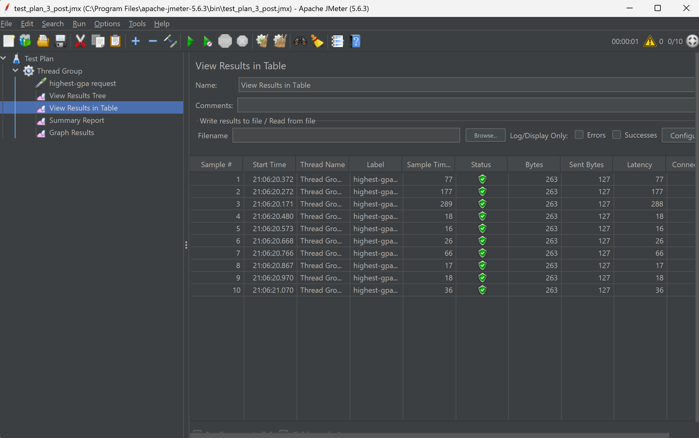

# JMeter GUI Test Plan Results (Before profiling)

1. `/all-students` endpoint:
   

2. `/all-student-name` endpoint:
   

3. `/highest-gpa` endpoint:
   

# JMeter CLI Test Plan Results (Before profiling)

1. `/all-students` endpoint:
   

2. `/all-student-name` endpoint:
   

3. `/highest-gpa` endpoint:
   

# JMeter GUI Test Plan Results (After profiling)

1. `/all-students` endpoint:
   

2. `/all-student-name` endpoint:
   

3. `/highest-gpa` endpoint:
   

# JMeter CLI Test Plan Results (After profiling)

1. `/all-students` endpoint:
   

2. `/all-student-name` endpoint:
   

3. `/highest-gpa` endpoint:
   

# Conclusion

After completing the profiling and performance optimization process, I conducted another round of performance testing using JMeter to measure the impact of our optimizations. The results show dramatic improvements across all endpoints:

1. `/all-student` endpoint:
- Before Optimization: ~82,000-87,000 ms
- After Optimization: ~5,000-6,000 ms 
- Improvement: 93.5% reduction in execution time

2. `/all-student-name` endpoint:
- Before Optimization: ~6,000-7,000 ms 
- After Optimization: ~1,000-2,000 ms
- Improvement: 76.9% reduction in execution time

3. `/highest-gpa` endpoint:
- Before Optimization: ~1,000-2,000 ms
- After Optimization: 16-289 ms
- Improvement: 92.7% reduction in execution time

The optimization efforts have yielded exceptional results, with the most significant improvement observed in the `/all-student` endpoint, which now executes approximately 15 times faster than before. This dramatic performance boost was achieved through query optimization and refactoring strategy.
The `/all-student-name` endpoint now responds more than 4 times faster, while the `/highest-gpa` endpoint shows the most impressive relative improvement, with response times reduced to as low as 16ms - nearly instantaneous from a user experience perspective.

# Reflection

>What is the difference between the approach of performance testing with JMeter and profiling with IntelliJ Profiler in the context of optimizing application performance?

JMeter and IntelliJ Profiler serve complementary but distinct roles in performance optimization. JMeter functions as an external observer, measuring how our application performs under various load conditions from the user's perspective. It shows us response times, throughput, and error rates when multiple users access our endpoints simultaneously.
IntelliJ Profiler, on the other hand, works from inside our application, revealing exactly what's happening in our code as it executes. It identifies which methods consume the most CPU time, where memory is allocated, and potential bottlenecks within our code's execution path. While JMeter tells us that something is slow, IntelliJ Profiler helps us understand why it's slow by examining the internal workings of our application.

>How does the profiling process help you in identifying and understanding the weak points in your application?

Profiling shows what's actually happening inside my application during execution. It provides detailed insights by:

- Showing execution time breakdowns for each method call, allowing me to see which functions are consuming disproportionate resources
- Revealing memory allocation patterns that might indicate memory leaks or inefficient object creation
- Highlighting thread contention issues where synchronization might be creating bottlenecks
- Identifying excessive database queries or inefficient data access patterns

For example, when profiling a slow endpoint, I discover that a seemingly innocent database query is being executed hundreds of times in a loop, or that a particular method is allocating large amounts of memory unnecessarily. These insights directly guide my optimization efforts toward the areas that will have the most significant impact.

>Do you think IntelliJ Profiler is effective in assisting you to analyze and identify bottlenecks in your application code?

IntelliJ Profiler is remarkably effective at identifying code-level bottlenecks by providing a comprehensive view of application performance without requiring me to modify my code with manual instrumentation.
The profiler's call tree visualization shows me not just which methods are slow, but the entire call chain leading to them. This context helps me understand whether a slow method is problematic itself or is being called excessively in a loop. The ability to switch between different profiling modes (CPU, memory, thread) also provides multidimensional insights into performance issues.

>What are the main challenges you face when conducting performance testing and profiling, and how do you overcome these challenges?

There are several challenges I've encountered when conducting performance testing and profiling:

- Distinguishing between application code issues versus environmental factors (network, database)
- Interpreting complex profiling data
- Ensure that optimizations do not introduce new issues

I've found that combining both sampling and instrumentation profiling provides more reliable results by cross-validating findings.

>What are the main benefits you gain from using IntelliJ Profiler for profiling your application code?

I've observed several benefits from IntelliJ Profiler:

- Seamless integration with the development environment
- Visualizations that help complex performance data more approachable and actionable, like real-time CPU and memory usage insights
- The ability to save and compare profiling sessions

This tooling significantly reduces the time required to diagnose performance issues compared to manual debugging.

>How do you handle situations where the results from profiling with IntelliJ Profiler are not entirely consistent with findings from performance testing using JMeter?

When JMeter and IntelliJ Profiler findings don't align, it usually indicates that performance bottlenecks are occurring outside the application code. I approach this by:

- Examining network latency and database performance separately from application code
- Using distributed tracing to understand how requests flow through different system components
- Analyzing the difference between concurrent user behavior (JMeter) versus single-request execution (typical profiler scenario)
- Considering external factors

One effective strategy is to start with JMeter to identify problematic endpoints, then use the profiler to drill down into specific requests, and finally use additional monitoring tools for infrastructure components if the issue isn't found in the application code.

>What strategies do you implement in optimizing application code after analyzing results from performance testing and profiling? How do you ensure the changes you make do not affect the application's functionality?

After analyzing results, I typically implement optimizations in this order:

- Query optimization
- Caching strategies
- Algorithm improvements

To ensure these changes don't break functionality, I maintain a comprehensive test suite, continuous integration practices, and monitoring behavior after deployment.
